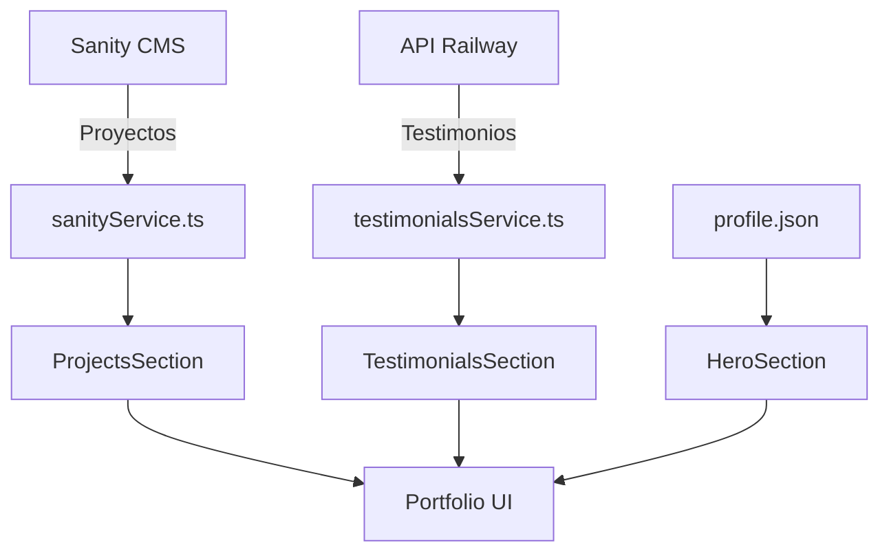

# 🎨 Portfolio Sebastian - Diseñador Gráfico Senior

<div align="center">
  
  
  ### Más que un diseñador, soy un estratega visual que convierte ideas complejas en experiencias memorables
  
  [](https://tu-dominio.com)
  [](https://reactjs.org/)
  [](https://sanity.io/)
  [](https://vitejs.dev/)
</div>

---

## ✨ Características Destacadas

### 🏗️ **Arquitectura Moderna**
- **Frontend**: React 18 + TypeScript + Vite
- **CMS Headless**: Sanity Studio integrado
- **Estilos**: Tailwind CSS + Shadcn/ui components
- **Animaciones**: Framer Motion para transiciones fluidas
- **Estado**: Hooks personalizados y Context API

### 🎯 **Funcionalidades Principales**

#### 📝 **Sistema de Gestión de Contenido (Sanity CMS)**
- **Gestión de Proyectos**: CRUD completo desde Sanity Studio
- **Imágenes Optimizadas**: CDN automático con múltiples formatos
- **Preview en Tiempo Real**: Visualización instantánea de cambios
- **Schemas Personalizados**: Estructura de datos optimizada

#### 💬 **Sistema de Testimonios en Tiempo Real**
- **API Externa Conectada**: Testimonios dinámicos desde Railway
- **Cache Inteligente**: Sistema de caché con TTL configurable
- **Retry Logic**: Manejo robusto de errores con reintentos
- **Fallback Graceful**: Datos locales como respaldo

#### 🎨 **Experiencia de Usuario Premium**
- **Diseño Responsivo**: Adaptado para todos los dispositivos
- **Animaciones Suaves**: Micro-interacciones con Framer Motion
- **Carga Progresiva**: Lazy loading e imágenes optimizadas
- **Navegación Fluida**: SPA con transiciones suaves

---

## 🚀 Inicio Rápido

### 📋 Prerrequisitos
- Node.js 18+ 
- npm o yarn
- Cuenta en Sanity.io
- API de testimonios configurada

### ⚡ Instalación

1. **Clonar el repositorio**
   ```bash
   git clone https://github.com/tu-usuario/portfolio-sebastian.git
   cd portfolio-sebastian
   ```

2. **Instalar dependencias**
   ```bash
   npm install
   # o
   yarn install
   ```

3. **Configurar variables de entorno**
   ```bash
   # Crea .env en la raíz del proyecto
   VITE_SANITY_PROJECT_ID=kysyrox3
   VITE_SANITY_DATASET=production
   VITE_API_BASE_URL=https://backend-portfolio-production-d539.up.railway.app/api
   VITE_TESTIMONIALS_ENDPOINT=valoraciones/portfolio
   ```

4. **Iniciar desarrollo**
   ```bash
   npm run dev
   # o
   yarn dev
   ```

5. **Abrir en el navegador**
   ```
   http://localhost:3000
   ```

---

## 🏗️ Arquitectura del Proyecto

### 📁 Estructura de Archivos
```
portfolio-sebastian/
├── 📱 components/           # Componentes React reutilizables
│   ├── 🏠 HeroSection.tsx     # Sección principal
│   ├── 👤 AboutSection.tsx    # Acerca de mí
│   ├── 🗂️  ProjectsSection.tsx # Portafolio de proyectos
│   ├── 💭 TestimonialsSection.tsx # Testimonios dinámicos
│   ├── 📞 ContactSection.tsx  # Formulario de contacto
│   └── 🎨 ui/                 # Componentes de Shadcn/ui
├── 🔧 services/            # Servicios API
│   ├── 📡 sanityService.ts    # Cliente Sanity CMS
│   └── 💬 testimonialsService.ts # API de testimonios
├── 📊 data/               # Datos estáticos
│   ├── 👤 profile.json       # Información personal
│   └── 🗂️  projects.json     # Proyectos destacados
├── 🎣 hooks/              # Hooks personalizados
├── 🎨 styles/             # Estilos globales
└── 📝 types/              # Definiciones TypeScript
```

### 🔄 Flujo de Datos



---

## 🛠️ Tecnologías y Herramientas

### **Frontend Core**
| Tecnología | Versión | Propósito |
|-----------|---------|-----------|
| ⚛️ React | 18.3.1 | Biblioteca principal |
| 🟦 TypeScript | 5.6.3 | Tipado estático |
| ⚡ Vite | 6.0.1 | Build tool moderno |
| 🎨 Tailwind CSS | 3.4.14 | Framework de estilos |

### **CMS y Datos**
| Servicio | Función | Estado |
|----------|---------|--------|
| 🏢 Sanity | CMS Headless | ✅ Configurado |
| 🚄 Railway API | Testimonios | ✅ Conectado |
| 📁 Local JSON | Datos estáticos | ✅ Implementado |

### **UI y Experiencia**
| Componente | Biblioteca | Propósito |
|------------|------------|-----------|
| 🎭 Animaciones | Framer Motion | Transiciones fluidas |
| 🧩 UI Components | Radix UI | Primitivos accesibles |
| 🎨 Design System | Shadcn/ui | Componentes pre-diseñados |
| 🔔 Notificaciones | Sonner | Toast notifications |

---

## 🎯 Casos de Uso Principales

### 1. **Gestión de Proyectos con Sanity**
```typescript
// Obtener proyectos desde Sanity CMS
const projects = await sanityService.getProjects();

// Características:
// ✅ CRUD completo desde Sanity Studio
// ✅ Imágenes optimizadas automáticamente
// ✅ Preview en tiempo real
// ✅ Versionado de contenido
```

### 2. **Sistema de Testimonios Dinámico**
```typescript
// API con cache inteligente y fallback
const testimonials = await testimonialsService.getTestimonials();

// Características:
// ✅ Cache con TTL configurable
// ✅ Retry automático en caso de error
// ✅ Fallback a datos locales
// ✅ Loading states optimizados
```

### 3. **Experiencia de Usuario Fluida**
```typescript
// Animaciones suaves y responsivas
<motion.div
  initial={{ opacity: 0, y: 20 }}
  animate={{ opacity: 1, y: 0 }}
  transition={{ duration: 0.5 }}
>
  {/* Contenido animado */}
</motion.div>
```

---

## 📈 Métricas y Rendimiento

### **Performance Optimizations**
- ⚡ **Lazy Loading**: Componentes y imágenes cargadas bajo demanda
- 🗜️ **Code Splitting**: Chunks optimizados automáticamente por Vite
- 📦 **Bundle Size**: < 300KB gzipped
- 🖼️ **Image Optimization**: CDN de Sanity con múltiples formatos
- 💾 **Caching Strategy**: Cache inteligente para APIs

### **SEO y Accesibilidad**
- 🔍 **Meta Tags**: Open Graph y Twitter Cards
- ♿ **Accessibility**: ARIA labels y navegación por teclado
- 📱 **Mobile First**: Diseño responsivo desde el inicio
- ⚡ **Core Web Vitals**: Optimizado para métricas de Google

---

## 🔧 Configuración Avanzada

### **Sanity CMS Setup**

1. **Configurar proyecto en Sanity**
   ```bash
   npm install -g @sanity/cli
   sanity init
   ```

2. **Schemas personalizados**
   ```javascript
   // schemas/project.js
   export default {
     name: 'project',
     title: 'Project',
     type: 'document',
     fields: [
       {
         name: 'title',
         title: 'Title',
         type: 'string'
       },
       // ... más campos
     ]
   }
   ```

### **API de Testimonios**

1. **Endpoint configurado**
   ```
   Base URL: https://backend-portfolio-production-d539.up.railway.app/api
   Endpoint: valoraciones/portfolio
   ```

2. **Formato de respuesta**
   ```json
   {
     "success": true,
     "data": [
       {
         "id": "1",
         "author": "Cliente",
         "rating": 5,
         "comment": "Excelente trabajo..."
       }
     ]
   }
   ```

---

## 🚢 Despliegue

### **Build de Producción**
```bash
# Crear build optimizado
npm run build

# Preview local del build
npm run preview
```

### **Opciones de Hosting**
| Plataforma | Configuración | Estado |
|------------|--------------|--------|
| 🔺 Vercel | Zero-config | ✅ Recomendado |
| 📡 Netlify | Auto-deploy | ✅ Compatible |
| 🌊 Railway | Full-stack | ✅ Configurado |
| 🔥 Firebase | SPA hosting | ✅ Compatible |

---

## 🤝 Contribución

### **Desarrollo Local**
1. Fork del repositorio
2. Crear rama feature: `git checkout -b feature/nueva-funcionalidad`
3. Commit cambios: `git commit -m 'Add: nueva funcionalidad'`
4. Push a la rama: `git push origin feature/nueva-funcionalidad`
5. Crear Pull Request

### **Estándares de Código**
- ✅ ESLint configurado
- ✅ TypeScript strict mode
- ✅ Prettier para formateo
- ✅ Conventional commits

---

## 📞 Contacto y Soporte

<div align="center">
  
### 🌟 Sebastian - Diseñador Gráfico Senior
  
**📧 Email**: [tu-email@ejemplo.com](mailto:tu-email@ejemplo.com)  
**💼 LinkedIn**: [/in/sebastian-diseñador](https://linkedin.com/in/sebastian)  
**🌐 Portfolio**: [sebastian-portfolio.com](https://tu-dominio.com)

---

### 📊 **Estadísticas del Proyecto**


**⭐ Si este proyecto te fue útil, ¡considera darle una estrella!**

</div>

---

## 📄 Licencia

Este proyecto está licenciado bajo la Licencia MIT - ver el archivo [LICENSE](LICENSE) para más detalles.

---

<div align="center">
  <sub>Construido con ❤️ por Sebastian usando React, Sanity CMS y las mejores prácticas de desarrollo moderno.</sub>
</div>